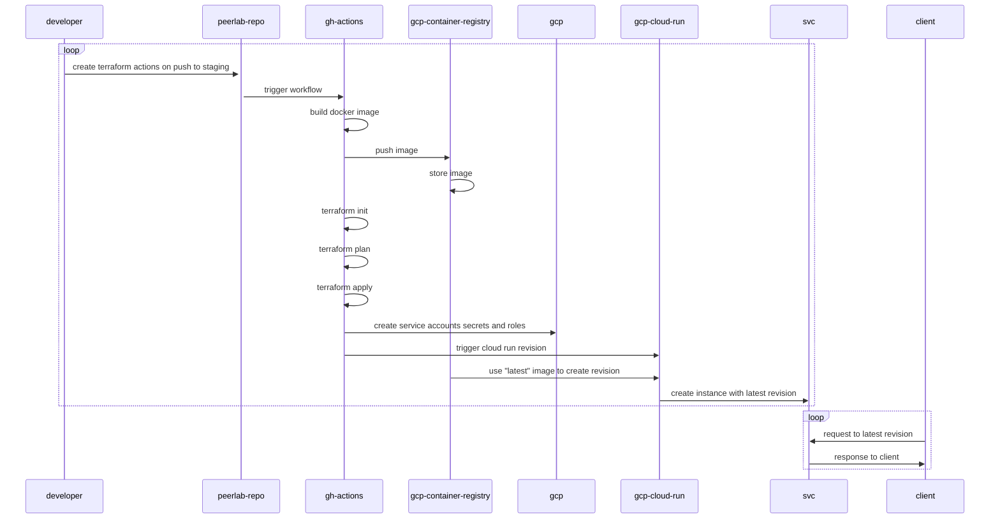

# PeerLab

PeerLab is a step towards [eA's vision](https://github.com/amaralc/ea). A way to connect university laboratories and the needs of the society while giving meaning and purpose to the actions of students in a sustainable way so they can perceive it every day.

While the whole thing isn't up and running, I keep using the idea to practice software development skills, mainly with TypeScript, Node.js, React, some Bash and Terraform. During the process I'm also trying to constantly practice lean principles.

> "If you eliminate enough waste, soon you go faster than the people who are just trying to go fast"
> (Beck and Andres, 2004)

## Mission

To make hiring services from university labs globally, as easy as buying a beer or a plane ticket.

## Vision

A world where universities are as popular as shopping centers and the scientific method is pervasive and entrenched in our society.

## Values

Communication, Simplicity, Feedback, Courage, Respect, Continuous Learning and Experimentation.

# Setup

## Requirements

- [Bun 1.0.2+](https://bun.sh/docs/installation)
- [Docker](https://docs.docker.com/engine/install/ubuntu/)
- [Terraform 1.5.7+](https://developer.hashicorp.com/terraform/downloads?product_intent=terraform)
- [GCloud CLI](https://cloud.google.com/sdk/docs/install)
- [GitHub CLI](https://cli.github.com/)

# Known Issues

- ~~ci(build): Connection between github and gcp is configured manually; Cloud build v2 allows automatic configuration, but requires contact with google sales team;~~
- ~~ci(build): Cloud Build is currently being triggered manually~~ (Fixed: we are now building with GitHub Actions, Terraform and Docker resources). (Fixed: we adopted GitHub Actions to build images, making it unnecessary to sync with GCP Repositories)
- ~~ci(build): After building a new image, it is necessary to trigger a new deployment of that service; Maybe a final github call by the end of every run, with a random name for every run, could do it. Another option would be to call the google api and create a new cloud run revision of that service.~~ (Fixed: adopting GitHub actions, Terraform and Docker resources)
- ci(auth): Automatic deployments can only create brands with internal access in GCP; External access needs to be configured manually;
- ~~ci(auth): We still do not have automatically assigned domains and subdomains. That prevents us from using firebase with a cloud run deployment since the generated domains are random;~~ (Fixed: generation of domains and subdomains are now automated).
- ci(auth): We need to manually enable the Google auth client through Firebase Console in order to sign in with google in our applications.
- ci(build): Unnecessary images are being built even though the project was not affected by the commit.

# Features

- [ ] CI/CD
  - [x] Manage cloud infrastructure with code;
  - [x] Create full stack preview environments if and when needed;
  - [ ] Automate builds and deployments (IN PROGRESS);
  - [ ] Manage feature toggles;
- [ ] Auth
  - [x] Sign in with Google;
  - [ ] Sign in with Microsoft;
  - [ ] Sign in with ORCID;
- [ ] Lab Admin Dashboard
  - [ ] Create organization;
    - [ ] Freemium;
    - [ ] Standard - Recurring revenue;
    - [ ] Enterprise - Recurring revenue;
  - [ ] Create and publish a machine in an organization;
  - [ ] Create and publish a service provided by the organization;
  - [ ] Members;
    - [ ] Invite members;
- [ ] Lab Research
  - [ ] Create and publish blog articles;
  - [ ] Create and publish success cases and reports;
- [ ] Lab Front
  - [ ] Services
    - [ ] List services
    - [ ] Show service details
    - [ ] Request service
  - [ ] Equipment
    - [ ] List equipment
    - [ ] Show equipment details
    - [ ] Book equipment (if you are listed as a machine user)
    - [ ] List users that know how to operate the equipment
    - [ ] List success cases
    - [ ] Show security procedures and safety requirements
    - [ ] Show operational procedures
    - [ ] Access training material
  - [ ] Members
    - [ ] List current members
    - [ ] List alumni
  - [ ] Research
    - [ ] Overview
    - [ ] Publications
    - [ ] Blog articles

# References

- Sutherland, J. and Sutherland, J. J. (2014). Scrum, Random House.
- Ries, E. (2017). The Lean Startup, Crown Business.
- Martin, R. C. (2019). Clean Agile, Prentice Hall.
- Beck, K. and Andres, C. (2004). Extreme Programming Explained, Addison-Wesley Professional.
- Skelton, M. and Pais, M. (2019). Team Topologies, It Revolution Press.
- Winters, T., Manshreck, T. and Wright, H. (2020). Software Engineering at Google: Lessons Learned from Programming over Time.
- Kim, G., Behr, K. and Spafford, G. (2018). The Phoenix Project, IT Revolution.
- Kim, G. (2019). The Unicorn Project, IT Revolution.
- Kim, G., Humble, J., Debois, P., Willis, J. and Forsgren, N. (2021). The DevOps Handbook, IT Revolution.

<!-- ## Use cases

The primary use case I had in mind, was to manage my books and tools. I often lend books to friends and colleagues and later find myself asking the same question: "Where is that book again?". If PeerLab could help me to find answers for that sort of question, than we are on the right track.

# Setup

## Prerequisites

- [Install NVM]()
- [Install NodeJS]()
- [Install Yarn]()
- [Install Docker Engine]()
- [Install Docker Compose]()
- [Mongo Database Tools](https://www.mongodb.com/docs/database-tools/installation/installation-linux/#installation)
- [Install Studio3T](https://github.com/Studio3T/robomongo)
- [Install Hasura CLI]()
- [Install Make]()
- [Install VSCode Rest Client Extension]()
- [Install NX Console Extension]()

## Infrastructure Setup

- (github) Fork this repository;
- (terminal) Clone repository: `git clone git@github.com:<your-username>/peerlab.git`;
- (terminal) Set up persistence layer: `make infra-setup`;
- (terminal) Verify that all containers are running: `docker ps`;
- (terminal) You should see 5 containers up and running:

  ```
    - confluent-control-center
    - kafka
    - hasura
    - postgres
    - zookeeper
  ```

## Run service-rest-api service

- (terminal) Install dependencies: `yarn install`;
- (terminal) Run project: `yarn service-rest-api:serve`;

# TODO

In order to keep track of what should be done, the project will be managed using github projects, although for faster development, I might take notes in the [todo.md file](./docs/todo.md), in this repository.

# Commits

This repository is using husky and commitlint to organize commit messages a little bit. Configuration references came from the following references:

- https://github.com/jdiponziano/next-nx-mfe/blob/stripped-code/.commitlintrc.json
- https://github.com/typicode/husky
- https://github.com/conventional-changelog/commitlint
- https://github.com/conventional-changelog/conventional-changelog

## Hooks

This repository include pre-commit hooks with Husky. There is a hook for checking if the commit message complies with the message formats and also a hook that runs all unit tests before the commit.

# Releases

We will start using conventional commits in order to experiment on the automation of changelog generation.

[Here](https://github.com/conventional-changelog/conventional-changelog) there are recommendations on how to handle that operation, and although [this](https://github.com/conventional-changelog/standard-version) link points out that the [standard-version](https://github.com/conventional-changelog/standard-version) library is deprecated, it was the simpler to configure. Other great alternative was the [semantic-release](https://github.com/semantic-release/semantic-release) library, but apparently it only works when using Node 18.

For now, for experimentation purposes, we will go with `standard-version`. Later on, I hope to be more familiar so that I can put an effort to switch to whatever other better option.

# Deployment

We are currently using terraform with some commands of fly cli and it works.

References:

- https://upstash.com/
- https://registry.terraform.io/providers/upstash/upstash/latest/docs
- https://payloadcms.com/
- https://fly.io/

# Use cases

## API

- (POST /peers) Create new user
- (GET /plan-subscriptions) List all plan subscriptions

# Consumer

- Consume 'plan-subscription-created' topic and add a new user to the database;

# Infrastructure as Code (IaC)

# CI / CD

## Overview



## GitHub actions environments

https://docs.github.com/en/actions/deployment/targeting-different-environments/using-environments-for-deployment

# Lessons Learned

- Use nx migrate; Use commit prefix option; It is worth it.

# Set up new environment

- Create new project on GCP;
- Create service account in gcp: `bash ./scripts/gcloud/service-account-create.sh`;
- Create storage bucket in gcp for terraform state: `bash ./scripts/gcloud/storage-bucket-create.sh`;
- Enable versioning on storage bucket: `bash ./scripts/gcloud/storage-bucket-versioning-enable.sh`;

# References

- https://github.com/devfullcycle/imersao-12-esquenta-kafka
- https://github.com/amaralc/nestjs-fundamentals
- https://github.com/amaralc/2022-course-rocketseat-ignite-lab-nodejs
- chat.openai.com -->
