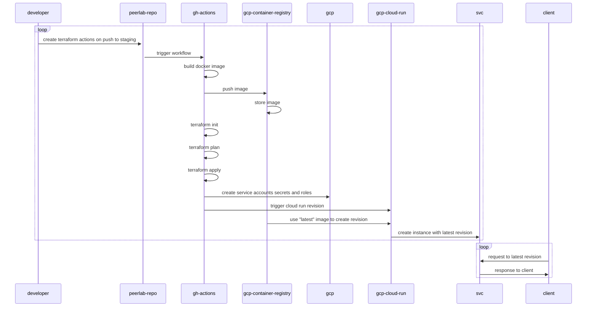

# PeerLab

PeerLab is a step towards [eA's vision](https://github.com/amaralc/ea). A way to connect university laboratories and the needs of the society while giving meaning and purpose to the actions of students in a sustainable way so they can perceive it every day.

While the whole thing isn't up and running, I keep using the idea to practice software development skills, mainly with TypeScript, Node.js, React, some Bash and Terraform.

## Use cases

The primary use case I had in mind, was to manage my books and tools. I often lend books to friends and colleagues and later find myself asking the same question: "Where is that book again?". If PeerLab could help me to find answers for that sort of question, than we are on the right track.

# Setup

## Prerequisites

- [Install NVM]()
- [Install NodeJS]()
- [Install Yarn]()
- [Install Docker Engine]()
- [Install Docker Compose]()
- [Mongo Database Tools](https://www.mongodb.com/docs/database-tools/installation/installation-linux/#installation)
- [Install Studio3T](https://github.com/Studio3T/robomongo)
- [Install Hasura CLI]()
- [Install Make]()
- [Install VSCode Rest Client Extension]()
- [Install NX Console Extension]()

## Infrastructure Setup

- (github) Fork this repository;
- (terminal) Clone repository: `git clone git@github.com:<your-username>/peerlab.git`;
- (terminal) Set up persistence layer: `make infra-setup`;
- (terminal) Verify that all containers are running: `docker ps`;
- (terminal) You should see 5 containers up and running:

  ```
    - confluent-control-center
    - kafka
    - hasura
    - postgres
    - zookeeper
  ```

## Run service-rest-api service

- (terminal) Install dependencies: `yarn install`;
- (terminal) Run project: `yarn service-rest-api:serve`;

# TODO

In order to keep track of what should be done, the project will be managed using github projects, although for faster development, I might take notes in the [todo.md file](./docs/todo.md), in this repository.

# Commits

This repository is using husky and commitlint to organize commit messages a little bit. Configuration references came from the following references:

- https://github.com/jdiponziano/next-nx-mfe/blob/stripped-code/.commitlintrc.json
- https://github.com/typicode/husky
- https://github.com/conventional-changelog/commitlint
- https://github.com/conventional-changelog/conventional-changelog

## Hooks

This repository include pre-commit hooks with Husky. There is a hook for checking if the commit message complies with the message formats and also a hook that runs all unit tests before the commit.

# Releases

We will start using conventional commits in order to experiment on the automation of changelog generation.

[Here](https://github.com/conventional-changelog/conventional-changelog) there are recommendations on how to handle that operation, and although [this](https://github.com/conventional-changelog/standard-version) link points out that the [standard-version](https://github.com/conventional-changelog/standard-version) library is deprecated, it was the simpler to configure. Other great alternative was the [semantic-release](https://github.com/semantic-release/semantic-release) library, but apparently it only works when using Node 18.

For now, for experimentation purposes, we will go with `standard-version`. Later on, I hope to be more familiar so that I can put an effort to switch to whatever other better option.

# Deployment

We are currently using terraform with some commands of fly cli and it works.

References:

- https://upstash.com/
- https://registry.terraform.io/providers/upstash/upstash/latest/docs
- https://payloadcms.com/
- https://fly.io/

# Use cases

## API

- (POST /peers) Create new user
- (GET /plan-subscriptions) List all plan subscriptions

# Consumer

- Consume 'plan-subscription-created' topic and add a new user to the database;

# Infrastructure as Code (IaC)

# CI / CD



# Lessons Learned

- Use nx migrate; Use commit prefix option; It is worth it.

# References

- https://github.com/devfullcycle/imersao-12-esquenta-kafka
- https://github.com/amaralc/nestjs-fundamentals
- https://github.com/amaralc/2022-course-rocketseat-ignite-lab-nodejs
- chat.openai.com
