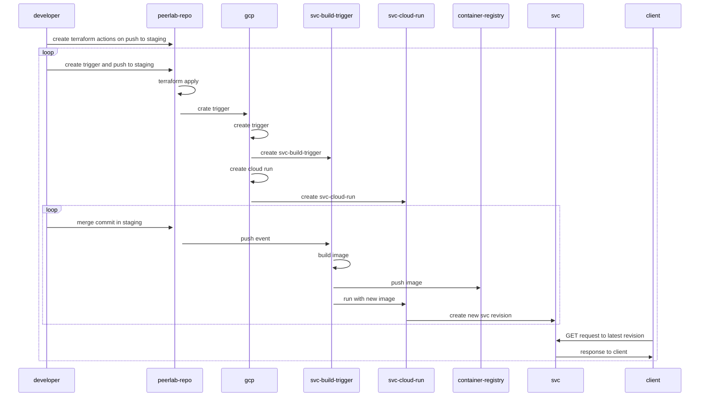

```mermaid
sequenceDiagram
    developer ->>+ peerlab-repo: create terraform actions on push to staging
    loop
        developer ->>+ peerlab-repo: create trigger and push to staging
        peerlab-repo ->>+ peerlab-repo: terraform apply
        peerlab-repo ->>+ gcp: crate trigger
        gcp ->> gcp: create trigger
        gcp ->> svc-build-trigger: create svc-build-trigger
        gcp ->> gcp: create cloud run
        gcp ->> svc-cloud-run: create svc-cloud-run
        loop
            developer ->>+ peerlab-repo: merge commit in staging
            peerlab-repo ->>+ svc-build-trigger: push event
            svc-build-trigger ->> svc-build-trigger: build image
            svc-build-trigger ->> container-registry: push image
            svc-build-trigger ->> svc-cloud-run: run with new image
            svc-cloud-run ->> svc: create new svc revision
        end
        client ->> svc:  GET request to latest revision
        svc ->> client: response to client
    end
```
