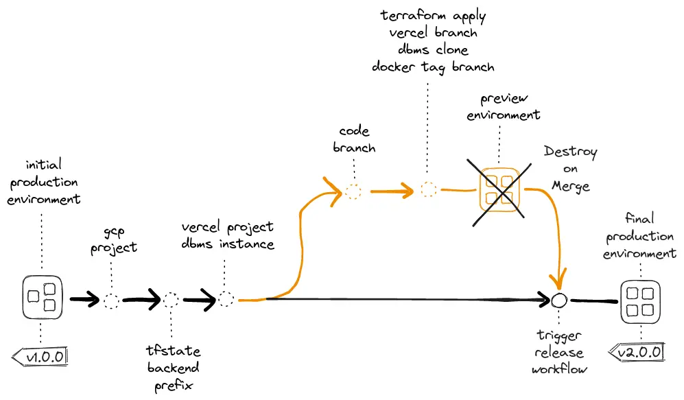
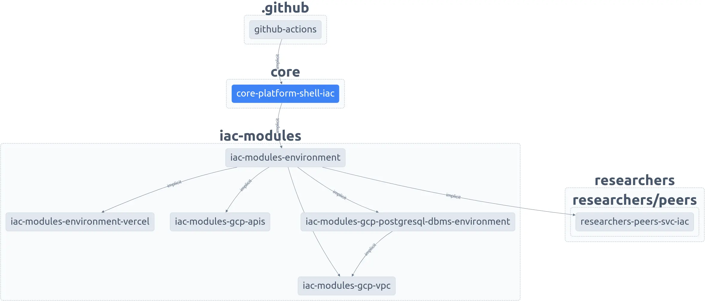
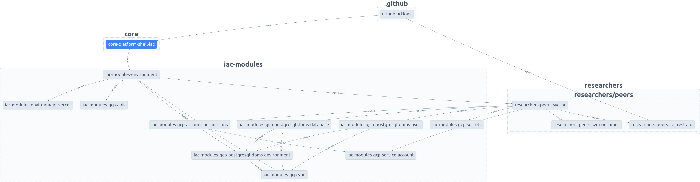
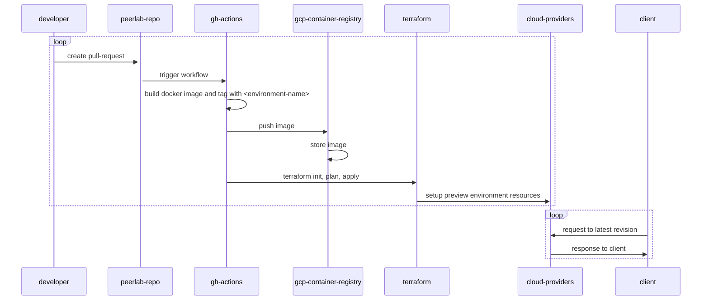

## Branching and Preview Deployments

### Vercel Preview Deployments

The concept of a preview deployment, while not entirely new, has been revolutionized by Vercel, enabling live visualization of app changes before merging into the production branch [(Vercel, 2023)](https://vercel.com/docs/concepts/deployments/preview-deployments). This feature enhances collaboration and accelerates feedback. It's application is very straightforward with full-stack frameworks like NextJS, providing frontend and backend code changes preview. However, for apps with diverse microservices, non-serverless components, and databases, creating preview environments can be significantly more complex.

### PlanetScale Database and Data Branching

Vercel's Preview Deployment innovation led to a similar concept for databases, introduced by PlanetScale. Built on Google's Vitess, PlanetScale is a MySQL-compatible platform that introduced "Branching," allowing developers to branch database schemas like code [(Ekechukwu, 2021)](https://planetscale.com/blog/building-planetscale-with-planetscale)[(PlanetScale, 2023)](https://planetscale.com/docs/concepts/branching). Later, PlanetScale's Data Branching® feature was introduced, enabling the creation of isolated database copies, including both schema and data, differing from regular branching which only involved schema changes [(PlanetScale, 2022)](https://planetscale.com/docs/concepts/data-branching).

### Neon: Serverless, Branchable PostgreSQL

PlanetScale's model was really great, but we wanted that model with PostgreSQL instead. Enters Neon, a fully managed, multi-cloud Postgres platform that separates storage and compute to offer autoscaling, branching, and bottomless storage [(Neon, 2023)](https://neon.tech/). In his article, Mahmoud Abdelwahab brings clarity to a development workflow that eliminates the "Staging" environments and replaces them with "Preview" environments using Vercel, GitHub Actions and Neon [(Abdelwahab, 2023)](https://neon.tech/blog/branching-with-preview-environments).

<br/>


<p align="center">Figure 1 - Neon Proposed Preview Environment. Source: <a href="https://neon.tech/blog/branching-with-preview-environments">(Abdelwahab, 2023)</a></p>

<br/>

With those concepts and resources available, we had a clear idea of what we wanted to achieve: we wanted to be able to preview the entire system before merging into the production branch. That means we wanted to create isolated preview environments for each pull request, with their own database, frontend applications, microservices, networks and permissions.

## Infrastructure as Code

### Terraform

Provisioning all the resources required to achieve that vision of a preview environment manually, could become a very tedious and error prone task. In order to automate that process, we decided to use Terraform, a tool that allows us to define our infrastructure as code. Terraform is a declarative language that allows us to define the desired state of our infrastructure, and it will take care of provisioning and managing the resources for us, while also allowing us to create modules, which are reusable pieces of code that can be used to provision similar resources in different environments [(Hashicorp, 2023)](https://developer.hashicorp.com/terraform).

### Terraform and Neon

The first road block we found was that Neon does not have an official Terraform provider yet. We tried using a provider offered by the community and it worked well for the most part, but we found that it was not yet ready for production as described in [this discussion thread](https://community.neon.tech/t/terraform-provider-to-manager-neon-resources/375/5). The speed of database branch provisioning was really impressive but we stumbled upon some instabilities during the creation of database branches.

### Terraform and Google Cloud Platform

Although Google Cloud Platform did not propose a solution for preview environments, it offered all the resources we needed to create them. The process was much less straightforward than we expected, and besides the database, we ended up needing to deal with a lot of networking resources, virtual private cloud, private ip addresses, routers, NATs, and so on. A list with some of the resources we ended up needing to create and are listed below.

1. **google_compute_network**: A Virtual Private Cloud (VPC) network, which is a virtual version of a traditional physical network. This is the first resource you need to create because all other resources will be connected to or associated with this network.
2. **google_vpc_access_connector**: Connects your Google Cloud Run service to the VPC network. It must be created after the VPC network and before the Cloud Run service.
3. **google_compute_global_address**: A global IP address that you reserve for your Google Cloud resources. It should be created after the VPC network and before the Cloud Router and Cloud NAT.
4. **google_service_networking_connection**: A peering connection that allows your VPC network to connect with Google-managed services (like Cloud SQL). It should be created after the VPC network and before the Cloud SQL instance.
5. **google_compute_router**: A virtual router within your VPC network. It's used to forward traffic between different subnets within your network. It should be created after the VPC network and global address, and before the Cloud NAT.
6. **google_compute_router_nat**: A Cloud NAT (Network Address Translation) gateway, which allows instances without external IP addresses to access the internet. It should be created after the VPC network, global address, and router.
7. **google_sql_database_instance**: Your Cloud SQL PostgreSQL database. It should be created after the VPC network and the service networking connection.
8. **google_cloud_run_service**: Your NestJS service deployed on Google Cloud Run. It should be created after the VPC network, VPC access connector, and Cloud SQL database instance.

## Nx Build System

Configuring, building and running the system in a production-like environment is a critical part of the development workflow as very well illustrated in the novels Phoenix Project [(Kim et al., 2013)](https://www.amazon.com.br/Phoenix-Project-Helping-Business-English-ebook/dp/B078Y98RG8/ref=sr_1_1?__mk_pt_BR=%C3%85M%C3%85%C5%BD%C3%95%C3%91&crid=1ZB0DUF0SC66X&keywords=Phoenix+Project&qid=1688917079&s=books&sprefix=phoenix+projec%2Cstripbooks%2C222&sr=1-1) and Unicorn Project [(Kim, 2019)](https://www.amazon.com.br/Unicorn-Project-Developers-Disruption-Thriving-ebook/dp/B07QT9QR41/ref=sr_1_1?__mk_pt_BR=%C3%85M%C3%85%C5%BD%C3%95%C3%91&crid=279LDDY90HQ52&keywords=Unicorn+project&qid=1688916968&s=books&sprefix=unicorn+project%2Cstripbooks%2C249&sr=1-1). Those workflow steps dictate the speed of the feedback loop of the entire development workflow. The faster the feedback loop, the faster we can iterate and deliver value to our customers.

Google has spent a tremendous amount of engineering effort over its lifetime in creating its own build system, with the goal of ensuring that their engineers were able to quickly and reliably build code. The effort has been so successful that Blaze, the main component of the build system, has been reimplemented several different times by ex-Googlers who have left the company [(Winters et al., 2020)](https://www.amazon.com/Software-Engineering-Google-Lessons-Programming/dp/1492082791), including [Nx](https://nx.dev/), initially created by the ex-Googlers [Victor Savkin](https://twitter.com/victorsavkin) and [Jeff Cross](https://twitter.com/jeffbcross).

Earlier in the process, we have decided to adopt Nx as our build system. Nx is a tool that allows us to build and test multiple applications and libraries in a single repository. It also provides a set of tools that help us enforce consistency and good practices across the entire codebase [(Nx, 2023)](https://nx.dev/).

### Nx Graph

Currently, our environment and its dependencies can be easily visualized by running a single nx cli command:

```bash title="Visualizing the Dependency Graph"
yarn nx graph
```

After running the command and setting up the view, we can reason about the dependencies between the different resources and how they are connected. Figure 2 gives us a good overview of how we are currently connecting the dots in our project. A GitHub Action will call the `core-platform-shell-iac` project (our root project), which in turn will instantiate one or multiple environments.

<br/>



<p align="center">Figure 2 - Nx Dependency Graph Overview</p>

<br/>

Each environment depends on a vercel environment (`iac-modules-environment-vercel`), some GCP APIs (`iac-modules-gcp-vpc`), a Virtual Private Cloud (`iac-modules-gcp-vpc`), a Database Management System environment (`iac-modules-gcp-postgresql-dbms-environment`), and a Cloud Run service, which lives under our `researchers-peers-svc-iac` Nx project.

If we increase the proximity view as shown in Figure 3, we can see other projects and modules that are related and play together to create our final system preview environment.

<br/>



<p align="center">Figure 3 - Nx Dependency Graph Detailed View</p>

<br/>

## Workflow and Terraform Project

Our preview deployment workflow starts with the creation of a pull request that points to our production branch. After that a series of steps are executed, and Figure 4 simplifies the actual workflow for the sake of clarity.



<p align="center">Figure 4 - Preview Deployment Workflow</p>

The workflow presented in Figure 4 also works for the production deployment with minor differences on what triggers the workflow and what Terraform backend is used to store the state of the infrastructure.

### Shell IaC Project

The preview `main.tf` file is responsible for calling an environment module that will create all the resources required for the preview environment.

```hcl title="main.tf"
# Preview Environment
module "preview-environment-01" {
  count                                                                = local.preview_environments_enabled == true ? 1 : 0
  source                                                               = "../../../../libs/iac-modules/environment"
  branch_name                                                          = "feature/example-branch-name"
  source_environment_branch_name                                       = local.source_environment_branch_name
  source_environment_dbms_instance_id                                  = data.google_sql_database_instance.production.id
  short_commit_sha                                                     = var.short_commit_sha
  gcp_project_id                                                       = var.gcp_project_id
  gcp_location                                                         = var.gcp_location
  gcp_docker_artifact_repository_name                                  = var.gcp_docker_artifact_repository_name
  production_environment_core_platform_shell_browser_vercel_project_id = var.core_platform_shell_browser_vercel_project_id
  depends_on                                                           = [data.google_sql_database_instance.production]
}
```

### Environment Module

The `environment` module then call other modules such as the `gcp-api` module that enables the required APIs in the project. Notice that in this approach (all environments in a single gcp project) we use a `count` variable as a feature flag, to enable the APIs only in the production environment. Weather this is the best approach or not is still a matter of discussion and we have yet to decide on that.

```hcl title="environment/main.tf"
# Enable APIs
module "gcp_apis" {
  count          = local.is_production_environment ? 1 : 0 # Since we are not using child projects, we need to enable APIs only in the production environment
  source         = "../gcp-apis"                           # path to the module
  gcp_project_id = local.project_id
  apis = [
    "compute.googleapis.com",
    "servicenetworking.googleapis.com",
    "sqladmin.googleapis.com",
    "iam.googleapis.com",
    "secretmanager.googleapis.com",
    "vpcaccess.googleapis.com",
    "run.googleapis.com",
  ]
}
```

After enabling the necessary APIs we then create the VPC network, the VPC access connector, the global address, the service networking connection, the router, the NAT, the database instance, the Cloud Run based microservices and the vercel deployments.

```hcl title="environment/main.tf"
# Enable APIs
module "gcp_apis" {
  count          = local.is_production_environment ? 1 : 0 # Since we are not using child projects, we need to enable APIs only in the production environment
  source         = "../gcp-apis"                           # path to the module
  gcp_project_id = local.project_id
  apis = [
    "compute.googleapis.com",
    "servicenetworking.googleapis.com",
    "sqladmin.googleapis.com",
    "iam.googleapis.com",
    "secretmanager.googleapis.com",
    "vpcaccess.googleapis.com",
    "run.googleapis.com",
  ]
}

# Create the main Virtual Private Cloud (VPC)
module "vpc" {
  source           = "../gcp-vpc"
  environment_name = local.short_environment_name # Limit the name to 24 characters
  gcp_project_id   = local.project_id
  gcp_location     = var.gcp_location
  depends_on       = [module.gcp_project, module.gcp_apis]
}

output "vpc" {
  value = module.vpc
}

# Create a PostgreSQL database management system (DBMS) instance clone for the preview environment
module "postgresql_dbms" {
  source                          = "../gcp-postgresql-dbms-environment"
  environment_name                = module.parsed_branch_name.instance
  gcp_project_id                  = local.project_id
  gcp_location                    = var.gcp_location
  gcp_network_id                  = module.vpc.private_network.id
  gcp_private_vpc_connection_id   = module.vpc.private_vpc_connection.id
  gcp_sql_dbms_source_instance_id = var.source_environment_dbms_instance_id
  source_environment_branch_name  = var.source_environment_branch_name
  depends_on                      = [module.gcp_project, module.vpc, module.gcp_apis]
}

output "postgresql_dbms_instance_id" {
  value = module.postgresql_dbms.gcp_sql_dbms_instance_id # Necessary to enable other branch environments to use this one as a source
}

# First Microservice
module "my-example-microservice-01" {
  source                              = "../../../apps/team/service/svc-iac"
  source_environment_branch_name      = var.source_environment_branch_name # Informs the type of environment in order to decide how to treat database and users
  environment_name                    = module.parsed_branch_name.instance
  gcp_project_id                      = local.project_id
  gcp_location                        = var.gcp_location
  short_commit_sha                    = var.short_commit_sha
  gcp_docker_artifact_repository_name = var.gcp_docker_artifact_repository_name
  gcp_sql_dbms_instance_host          = module.postgresql_dbms.gcp_sql_dbms_instance_host
  gcp_sql_dbms_instance_name          = module.postgresql_dbms.gcp_sql_dbms_instance_name
  gcp_vpc_access_connector_name       = module.vpc.gcp_vpc_access_connector_name # Necessary to stablish connection with database
  depends_on                          = [module.postgresql_dbms, module.gcp_apis, module.gcp_project]
}

# Second Microservice
module "my-example-microservice-02" {
  source                              = "../../../apps/team/service/svc-iac"
  source_environment_branch_name      = var.source_environment_branch_name # Informs the type of environment in order to decide how to treat database and users
  environment_name                    = module.parsed_branch_name.instance
  gcp_project_id                      = local.project_id
  gcp_location                        = var.gcp_location
  short_commit_sha                    = var.short_commit_sha
  gcp_docker_artifact_repository_name = var.gcp_docker_artifact_repository_name
  gcp_sql_dbms_instance_host          = module.postgresql_dbms.gcp_sql_dbms_instance_host
  gcp_sql_dbms_instance_name          = module.postgresql_dbms.gcp_sql_dbms_instance_name
  gcp_vpc_access_connector_name       = module.vpc.gcp_vpc_access_connector_name # Necessary to stablish connection with database
  depends_on                          = [module.postgresql_dbms, module.gcp_apis, module.gcp_project]
}

# Application Shell
module "my-frontend-application-shell" {
  source                           = "../environment-vercel"
  project_name                     = "my-frontend-application-shell"
  framework                        = "nextjs"
  git_provider                     = "github"
  username_and_repository          = "username/repository-name"
  branch_name                      = var.branch_name
  is_production_environment        = local.is_production_environment
  install_command                  = local.is_production_environment ? "yarn install" : null
  build_command                    = local.is_production_environment ? "npx nx build my-frontend-application-shell --prod" : null
  output_directory                 = local.is_production_environment ? "dist/apps/core/platform-shell-browser/.next" : null
  ignore_command                   = null
  preview_environment_variables    = null
  production_environment_variables = null
  source_environment_project_id    = var.production_environment_my-frontend-application-shell_vercel_project_id

  depends_on = [module.my-example-microservice-01, module.my-example-microservice-02]
}
```

Each of the modules called, might call other modules that eventually call `resource` or `data` blocks that will create the actual resources in the cloud provider. Terraform orchestrates the creation of all the resources in the correct order, and it also allows us to destroy all the resources with a single command, all by interacting with the cloud providers public APIs.

:::tip

In GCP, when you clone a database instance, you bring the data, the users, and the permissions from the source to the newly created instance [(Google Cloud, 2023)](https://cloud.google.com/sql/docs/postgres/clone-instance). In this
case, if you try to replicate the environment by creating a database and user with the same name, you will get an error because they already exist. We have learned that the hard way, but now you can avoid making the same mistake.

:::

## Conclusions

The combination of the concepts brought by Vercel, PlanetScale and Neon, helped us to re-imagine what a development workflow could look like even for complex applications and multiple moving parts. These concepts, combined with infrastructure automation and build tools have enabled us to create isolated preview environments for each pull request, encompassing databases, frontend applications, microservices, networks, and permissions, thus enhancing collaboration and accelerating feedback.

However, the journey to this point was not without challenges. The use of Terraform to automate the process of provisioning resources was crucial, but we encountered roadblocks such as Neon's lack of an official Terraform provider and the complexity of setting up resources on Google Cloud Platform. Despite these challenges, we were able to overcome them and create a minimum viable workflow concept.

Finally, the adoption of the Nx build system, has been instrumental in our development workflow. It has allowed us to build and test multiple applications and libraries in a single repository, enforcing consistency and good practices across the entire codebase. Furthermore, the Nx Graph helps us to understand how the modules and projects depend on one another, which in turn let's us enhance the overall design very quickly. The journey to this point has been challenging, but the result is a validated workflow that can allows us to deliver value to our customers faster and more efficiently than ever before.


<p align="center">Figure 5 - System Preview Environments Workflow</p>

## References

- Vercel. (2023, February 15). Preview Deployments Overview, Vercel Documentation. Retrieved July 9, 2023, from https://vercel.com/docs/concepts/deployments/preview-deployments
- Kim, G., Behr, K. and Spafford, G. (2013). The Phoenix Project: A Novel about IT, DevOps, and Helping Your Business Win, IT Revolution Press.
- Kim, G. (2019). The Unicorn Project: A Novel about Developers, Digital Disruption, and Thriving in the Age of Data, IT Revolution Press.
- Winters, T., Manshreck, T. and Wright, H. (2020). Software Engineering at Google: Lessons Learned from Programming over Time.
- Ekechukwu, I. (2021, August 18). Building PlanetScale with PlanetScale, Building PlanetScale with PlanetScale. Retrieved July 9, 2023, from https://planetscale.com/blog/building-planetscale-with-planetscale
- PlanetScale. (2023, June 21). Branching — PlanetScale Documentation, Branching — PlanetScale Documentation. Retrieved July 9, 2023, from https://planetscale.com/docs/concepts/branching
- PlanetScale. (2022, July 22). Data Branching® — PlanetScale Documentation, Data Branching® — PlanetScale Documentation. Retrieved July 9, 2023, from https://planetscale.com/docs/concepts/data-branching
- Neon. (2023). Neon — Serverless, Fault-Tolerant, Branchable Postgres, Neon. Retrieved July 9, 2023, from https://neon.tech/
- Abdelwahab, M. (2023, April 14). A database for every preview environment using Neon, GitHub Actions, and Vercel - Neon, Neon. Retrieved July 9, 2023, from https://neon.tech/blog/branching-with-preview-environments
- Neon Developer workflow using Vercel and Github Actions. (2023, April 4). YouTube. Retrieved from https://www.youtube.com/watch?v=jjRasfbeYHk
- Hashicorp. (2023). Terraform | HashiCorp Developer, Terraform | HashiCorp Developer. Retrieved July 9, 2023, from https://developer.hashicorp.com/terraform
- Hashicorp. (n.d.). Modules Overview - Configuration Language | Terraform | HashiCorp Developer, Modules Overview - Configuration Language | Terraform | HashiCorp Developer. Retrieved July 9, 2023, from https://developer.hashicorp.com/terraform/language/modules
- Nx. (2023). Nx: Smart, Fast and Extensible Build System, Nx: Smart, Fast and Extensible Build System. Retrieved July 9, 2023, from https://nx.dev
- Google Cloud. (n.d.). Configuring deployment previews | Cloud Run Documentation | Google Cloud, Google Cloud. Retrieved July 9, 2023, from https://cloud.google.com/run/docs/tutorials/configure-deployment-previews
- GoogleCloudPlatform. (2022, September 27). GitHub - GoogleCloudPlatform/solutions-terraform-cloudbuild-gitops, GitHub. Retrieved from https://github.com/GoogleCloudPlatform/solutions-terraform-cloudbuild-gitops
- Moustakis, I. (2022, November 10). Managing Terraform with GitHub Actions & How to Scale, Spacelift. Retrieved July 9, 2023, from https://spacelift.io/blog/github-actions-terraform
- Google Cloud. (n.d.). What is Cloud SQL? | Cloud SQL for MySQL | Google Cloud, Google Cloud. Retrieved July 9, 2023, from https://cloud.google.com/sql/docs/mysql/introduction
- Google Cloud. (n.d.). Private Google Access | VPC | Google Cloud, Google Cloud. Retrieved July 9, 2023, from https://cloud.google.com/vpc/docs/private-google-access
- Google. (n.d.). Private Service Connect | VPC | Google Cloud, Google Cloud. Retrieved July 9, 2023, from https://cloud.google.com/vpc/docs/private-service-connect
- Google. (n.d.). Private services access | VPC | Google Cloud, Google Cloud. Retrieved July 9, 2023, from https://cloud.google.com/vpc/docs/private-services-access
- Google Cloud. (n.d.). Serverless VPC Access | Google Cloud, Google Cloud. Retrieved July 9, 2023, from https://cloud.google.com/vpc/docs/serverless-vpc-access
- Google Cloud. (n.d.). Connect to a VPC network | Cloud Run Documentation | Google Cloud, Google Cloud. Retrieved July 9, 2023, from https://cloud.google.com/run/docs/configuring/connecting-vpc
- terraform-google-modules and Google Cloud. (n.d.). terraform-docs-samples/run/vpc_access_connector/main.tf at main · terraform-google-modules/terraform-docs-samples, GitHub. Retrieved July 9, 2023, from https://github.com/terraform-google-modules/terraform-docs-samples
- terraform-google-modules and Google Cloud. (n.d.). terraform-google-network/examples/submodule_vpc_serverless_connector/main.tf at 34513531ea7246cfea3a43feef86d5c2151eda4b · terraform-google-modules/terraform-google-network, GitHub. Retrieved July 9, 2023, from https://github.com/terraform-google-modules/terraform-google-network
- Google Cloud. (n.d.). Terraform Registry, Terraform Registry. Retrieved July 9, 2023, from https://registry.terraform.io/providers/hashicorp/google/latest/docs/resources/sql_database_instance
- Google Cloud. (2021, August 19). Dev, test, and production environments with Google Serverless #shorts, YouTube. Retrieved July 9, 2023, from https://www.youtube.com/shorts/T5xJTPOMfe8
- Google Cloud. (2023). Clone instances | Cloud SQL for PostgreSQL | Google Cloud, Google Cloud. Retrieved July 9, 2023, from https://cloud.google.com/sql/docs/postgres/clone-instance
- Overview of environments | Firebase Documentation. (2023). Firebase. Retrieved August 6, 2023, from https://firebase.google.com/docs/projects/dev-workflows/overview-environments
