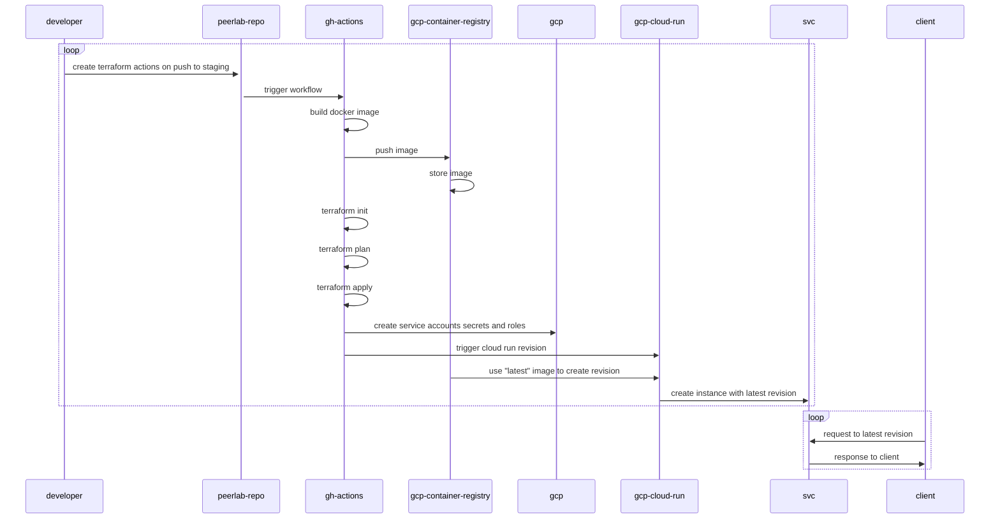

# Hello

Testing

```mermaid
  sequenceDiagram
    loop
        developer ->>+ peerlab-repo: create terraform actions on push to staging
        peerlab-repo ->> gh-actions: trigger workflow
        gh-actions ->> gh-actions: build docker image
        gh-actions ->> gcp-container-registry: push image
        gcp-container-registry ->> gcp-container-registry: store image
        gh-actions ->> gh-actions: terraform init
        gh-actions ->> gh-actions: terraform plan
        gh-actions ->> gh-actions: terraform apply
        gh-actions ->> gcp: create service accounts secrets and roles
        gh-actions ->> gcp-cloud-run: trigger cloud run revision
        gcp-container-registry ->> gcp-cloud-run: use "latest" image to create revision
        gcp-cloud-run ->> svc: create instance with latest revision
    end
    loop
        client ->> svc: request to latest revision
        svc ->> client: response to client
    end
```
