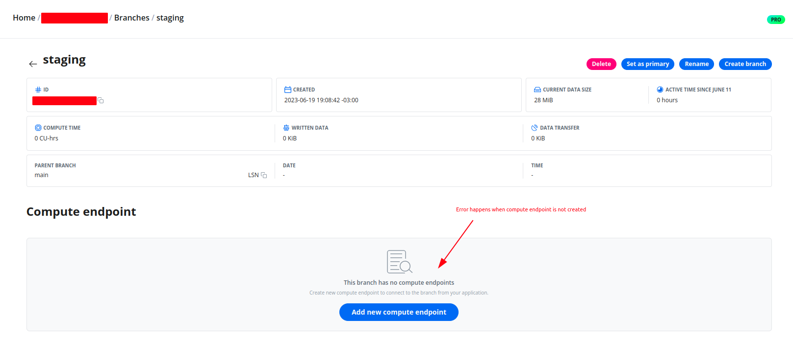

[A little context here]

## Planet Scale Database

- Database branching;
- Serverless database;
- MySQL;

## Neon Database

- Database branching;
- Serverless database;
- PostgreSQL;

## Terraform

- Creating and destroying resources;
- Stop using click-ops;
- Infrastructure as code;

## Neon Terraform Provider

- Neon APIs;
- Community Neon Terraform providers;
  - Lack of official support;
  - terraform-community-providers/neon - https://registry.terraform.io/providers/terraform-community-providers/neon/latest/docs
  - kislerdm/neon - https://registry.terraform.io/providers/kislerdm/neon/latest/docs

## kislerdm/neon

- Great provider;
- Limitation -> integer cpu (out of free plan);
- Most of the time it works when building locally;
- Fails when building on GitHub Actions;

```bash
module.staging.module.researchers-peers-svc.google_project_iam_binding.secret_accessor: Creation complete after 9s [id=***/roles/secretmanager.secretAccessor]
╷
│ Error: [HTTP Code: 409][Error Code: ] branch with the provided name "staging" already exists
│
│   with module.staging.module.postgresql-dbms-environment.neon_branch.postgresql-dbms-environment,
│   on postgresql-dbms-environment/main.tf line 1, in resource "neon_branch" "postgresql-dbms-environment":
│    1: resource "neon_branch" "postgresql-dbms-environment" ***
│
╵
╷
│ Error: [HTTP Code: 409][Error Code: ] branch with the provided name "production" already exists
│
│   with module.production.module.postgresql-dbms-environment.neon_branch.postgresql-dbms-environment,
│   on postgresql-dbms-environment/main.tf line 1, in resource "neon_branch" "postgresql-dbms-environment":
│    1: resource "neon_branch" "postgresql-dbms-environment" ***
│
╵
```

- Compute endpoints are not created for some reason while building on GitHub Actions and the error says the branch already exists;



- Compute endpoints were created manually;
- Still fails with the same error and now tfstate is inconsistent with the actual infrastructure state;
- I have started a discussion about it here: https://community.neon.tech/t/terraform-provider-to-manager-neon-resources/375/6
