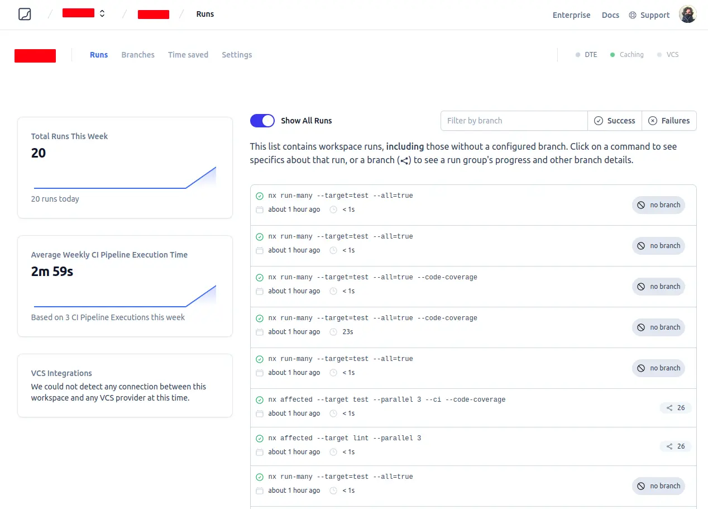
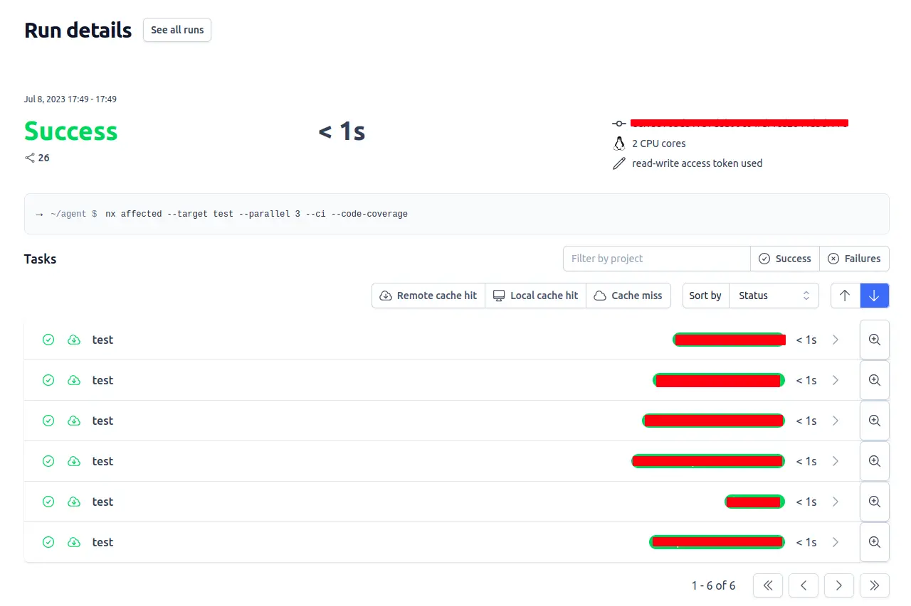
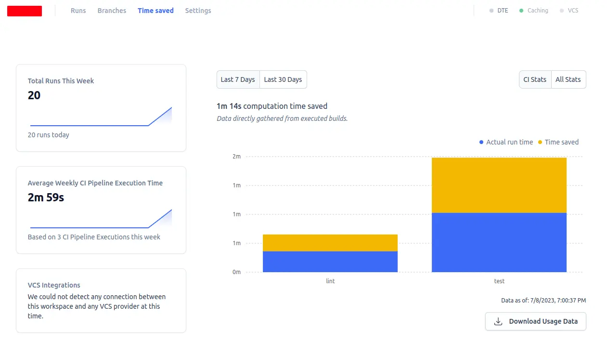

## Introduction

This article will guide you through the process of integrating Nx Cloud into your Continuous Integration/Continuous Delivery (CI/CD) pipeline. By incorporating Nx Cloud into our project, we can benefit from features like distributed caching, which greatly enhances CI performance.

## Setting up Nx Cloud

To begin, we need to connect our project to the Nx Cloud. This connection allows us to start using the helpful features provided by Nx Cloud. You can do this using the following command:

```bash title="Connect to Nx Cloud"
npx nx connect-to-nx-cloud
```

By running the mentioned command, the integration of Nx Cloud with your project is initialized. Following this, you'll be prompted to activate distributed caching. Enabling this feature could notably accelerate your CI pipeline.

```bash title="Output"
✔ Enable distributed caching to make your CI faster · Yes
```

Once you've confirmed the prompt, Nx Cloud will complete its initialization. Subsequently, you will receive a link to claim your dedicated workspace.

```bash title="Output"
...nx installation output omitted for brevity...

$ /home/my/path/to/project/node_modules/.bin/nx g nx-cloud:init

>  NX  Generating nx-cloud:init

UPDATE nx.json

 >  NX   Distributed caching via Nx Cloud has been enabled

   In addition to the caching, Nx Cloud provides config-free distributed execution,
   UI for viewing complex runs and GitHub integration. Learn more at https://nx.app

   Your workspace is currently unclaimed. Run details from unclaimed workspaces can be viewed on cloud.nx.app by anyone
   with the link. Claim your workspace at the following link to restrict access.

   https://cloud.nx.app/orgs/workspace-setup?accessToken=252f10c83610ebca1a059c0bae8255eba2f95be4d1d7bcfa89d7248a82d9f111

Done in 2.21s.
```

To claim your workspace, simply click on the provided link. This will redirect you to the Nx Cloud website where you can officially claim your workspace.

## Access Token, CI/CD and Version Control

At this stage, your `nx.json` file should have been updated with the access token and may resemble something like this:

```json title="nx.json"
{
  ...
  "tasksRunnerOptions": {
    "default": {
      "runner": "nx-cloud",
      "options": {
        "cacheableOperations": ["build", "lint", "test", "e2e"],
        "accessToken": "252f10c83610ebca1a059c0bae8255eba2f95be4d1d7bcfa89d7248a82d9f111"
      }
    }
  },
  ...
}
```

The generated token (in this case represented as "252f10c83610ebca1a059c0bae8255eba2f95be4d1d7bcfa89d7248a82d9f111") plays a crucial role in initiating the connection to Nx Cloud. As a [read/write token](https://nx.dev/nx-cloud/account/access-tokens), its confidentiality must be strictly maintained to avoid inadvertent exposure in our version control system.

### Using the token as an environment variable

The [Nx documentation](https://nx.dev/nx-cloud/account/access-tokens) provides a couple strategies for employing the access token in both local and CI pipeline contexts. It mentions that it is common to store a read-only token in `nx.json`, with a read/write token being set via the `NX_CLOUD_ACCESS_TOKEN` environment variable in the CI pipeline. However, committing even a read token to a public repository doesn't seem prudent. Similar concerns have been echoed by other developers in [this GitHub issue](https://github.com/nrwl/nx/issues/3649).

Given these considerations, we opted to substitute the token in `nx.json` with a placeholder value that can safely be committed to source control. During CI pipeline execution, this placeholder value is then replaced with the actual token stored in a repository secret. This method ensures we don't expose our token to the public repository.

```json title="nx.json with fake token"
{
  ...
  "tasksRunnerOptions": {
    "default": {
      "runner": "nx-cloud",
      "options": {
        "cacheableOperations": ["build", "lint", "test", "e2e"],
        "accessToken": "fake-token"
      }
    }
  },
  ...
}
```

In order to effectively swap the placeholder with the actual token during the CI execution, we've crafted a bash script specifically for this task. This script takes the real access token as an argument and seamlessly replaces the "fake-token" in the `nx.json` file:

```bash title="scripts/nx/set-token.sh"
#!/bin/bash

# This script accepts named arguments and overrites the token from nx.json with a token of your choice

# Expected named arguments:
# --access-token

# Call this script with the following command: bash scripts/nx/set-token.sh --access-token=my-secret-token

for i in "$@"                       # This starts a loop that iterates over each argument passed to the script. "$@" is a special variable in bash that holds all arguments passed to the script.
do                                  # This is the start of the loop block.
case $i in                          # This starts a case statement, which checks the current argument ($i) against several patterns.
    --access-token=*)               # This starts a new case statement pattern.
    ACCESS_TOKEN="${i#*=}"          # Assign the value after the equal sign, to a variable. This pattern matches any argument that starts with "--access-token=". The ${i#*=} syntax removes the prefix "--access-token=" from the argument.
    shift                           # This removes the current argument from the list of arguments. This is necessary because the argument is no longer needed.
    ;;                              # This ends the case statement pattern.
esac                                # This ends the case statement.
done                                # This ends the loop block.

# Check if ACCESS_TOKEN is set
if [ -z "$ACCESS_TOKEN" ]
then
    echo "Error: --access-token flag is required"
    exit 1
fi

# Overrite token from nx.json
jq --arg access_token "$ACCESS_TOKEN" '.tasksRunnerOptions.default.options.accessToken = $access_token' nx.json > tmp.$$.json && mv tmp.$$.json nx.json
```

## Github Actions Workflow

In our GitHub Actions workflow, we can now correctly set the token by invoking the aforementioned script as a step before initiating the lint and test process:

```yaml title=".github/workflows/ci.yml"
name: Lint and test affected projects

on:
  pull_request:
    types: [opened, synchronize] # Workflow triggering events

env:
  HUSKY: 0

jobs: # A workflow can have multiple jobs
  pr-checks: # Name of the job
    runs-on: ubuntu-latest # Instance type where job will run
    defaults:
      run:
        working-directory: ${{ github.workspace }}
    strategy:
      matrix:
        node-version: [18]
        npm-version: [8]
        yarn-version: ['1.22.x']
        pnpm-version: [7]
    steps:
      - name: Checkout [Pull Request] # Download code from the repository
        uses: actions/checkout@v2 # Public action
        with:
          ref: ${{ github.event.pull_request.head.sha }}
          token: ${{ secrets.GITHUB_TOKEN }}
          fetch-depth: 0 # Checkout all branches and tags

      # Replaces the fake token in the nx.json file with the real one from Github Secrets
      - name: Override fake nx token
        run: |
          bash scripts/nx/set-token.sh --access-token=${{ secrets.NX_ACCESS_TOKEN }}

      # Sets the base and head SHA's for the `nx affected` commands
      - name: Derive appropriate SHAs for base and head for `nx affected` commands
        uses: nrwl/nx-set-shas@v2 # Public action
        with:
          main-branch-name: ${{ github.base_ref }}

      # Detects the package manager used in the project (yarn, npm, or pnpm)
      - name: Detect package manager
        id: package_manager
        run: |
          echo "package_manager=$([[ -f ./yarn.lock ]] && echo "yarn" || ([[ -f ./pnpm-lock.yaml ]] && echo "pnpm") || echo "npm")" >> $GITHUB_ENV

      # Sets the versions of node, npm, and yarn using the Volta tool
      - name: Set node/npm/yarn versions using volta
        uses: volta-cli/action@v3
        with:
          node-version: '${{ matrix.node-version }}'
          npm-version: '${{ matrix.npm-version }}'
          yarn-version: '${{ matrix.yarn-version }}'

      # Installs PNPM if the detected package manager is pnpm
      - name: Install PNPM
        if: env.package_manager == 'pnpm'
        uses: pnpm/action-setup@v2.2.1
        with:
          version: '${{ matrix.pnpm-version }}'

      # Prints out the versions of node, npm, yarn, and pnpm
      - name: Print node/npm/yarn/pnpm versions
        id: versions
        run: |
          node_ver=$( node --version )
          yarn_ver=$( yarn --version || true )
          pnpm_ver=$( pnpm --version || true )
          echo "Node: ${node_ver:1}"
          echo "NPM: $(npm --version )"
          if [[ $yarn_ver != '' ]]; then echo "Yarn: $yarn_ver"; fi
          if [[ $pnpm_ver != '' ]]; then echo "PNPM: $pnpm_ver"; fi
          echo "node_version=${node_ver:1}" >> $GITHUB_ENV

      # If the detected package manager is npm, restore the cache (if available)
      - name: Use the node_modules cache if available [npm]
        if: env.package_manager == 'npm'
        uses: actions/cache@v2
        with:
          path: ~/.npm
          key: ${{ runner.os }}-node-${{ env.node_version }}-${{ hashFiles('**/package-lock.json') }}
          restore-keys: |
            ${{ runner.os }}-node-${{ env.node_version }}-

      # If the detected package manager is pnpm, restore the cache (if available)
      - name: Use the node_modules cache if available [pnpm]
        if: env.package_manager == 'pnpm'
        uses: actions/cache@v2
        with:
          path: ~/.pnpm-store
          key: ${{ runner.os }}-node-${{ env.node_version }}-${{ hashFiles('**/pnpm-lock.yaml') }}
          restore-keys: |
            ${{ runner.os }}-node-${{ env.node_version }}-

      # If the detected package manager is yarn, get the cache directory path
      - name: Get yarn cache directory path
        if: env.package_manager == 'yarn'
        id: yarn-cache-dir-path
        run: echo "yarn_cache_dir_path=$(yarn cache dir)" >> $GITHUB_ENV

      # If the detected package manager is yarn, restore the cache (if available)
      - name: Use the node_modules cache if available [yarn]
        if: env.package_manager == 'yarn'
        uses: actions/cache@v2
        with:
          path: ${{ env.yarn_cache_dir_path }}
          key: ${{ runner.os }}-node-${{ env.node_version }}-yarn-${{ hashFiles('**/yarn.lock') }}
          restore-keys: |
            ${{ runner.os }}-node-${{ env.node_version }}-

      # Installs dependencies using the appropriate package manager
      - name: Install dependencies
        run: |
          if [ "${{ env.package_manager == 'yarn' }}" == "true" ]; then
            echo "Running yarn install --frozen-lockfile"
            yarn install --frozen-lockfile
          elif [ "${{ env.package_manager == 'pnpm' }}" == "true" ]; then
            echo "Running pnpm install --frozen-lockfile"
            pnpm install --frozen-lockfile
          else
            echo "Running npm ci"
            npm ci
          fi

      # Lint and test affected projects
      - name: Lint and test affected projects
        run: |
          npx nx affected --target lint --parallel 3
          npx nx affected --target test --parallel 3 --ci --code-coverage

      # Replaces the real token with a fake one in the nx.json file to avoid leaking it
      - name: Override nx token back to fake value # Avoid leaking the token
        run: |
          bash scripts/nx/set-token.sh --access-token=fake-token
```

## Cache Hit

After a pull-request triggers the pipeline, the initial run populates the Nx Cloud cache with the results of executed lint and test operations. Subsequent runs can then leverage this cache, significantly accelerating the CI/CD pipeline.

You can confirm this by visiting your [Nx Cloud runs dashboard](https://cloud.nx.app/) and inspecting the latest runs, as shown in Figure 1. Runs that usually take 23s to complete, now take only 1s. This is more than **95% reduction in execution time**!



<p align="center">Figure 1 - Nx Cloud runs dashboard</p>

<br/>

By selecting a single run, you can inspect the details of the execution (Figure 2), including whether the cache was utilized.



<p align="center">Figure 2 - Run Details</p>

Under the "Time Saved" tab, you can also see how many minutes were saved in CI due to the caching mechanism (Figure 3). This measure is crucial as it quantifies the benefits of employing the remote cache feature.



<p align="center">Figure 3 - Time Saved in CI</p>

## Conclusion and Known Issues

By integrating Nx Cloud and employing a touch of scripting, we have managed to craft a secure and efficient CI/CD pipeline. This pipeline effectively utilizes the distributed caching mechanism provided by Nx Cloud to expedite our build times.

However, while this solution is impressive, it is not without its limitations. For instance, it's essential to be aware of the influence of environment variables and their impact on the cache. If an environment variable is altered, we would desire a fresh build that doesn't rely on the cache. We'll address this issue, along with others, in upcoming articles.

Until next time!

## References

- Senpai, G. (2022, May 13). GitHub - guysenpai/nx-workspace-core: Nx monorepo for publishing libraries with semantic-version, GitHub. Retrieved from https://github.com/guysenpai/nx-workspace-core
- Senpai, G. (2022, May 17). Nx monorepo: publish libraries to Github Packages with Github Actions & Semantic release —…, Medium. Retrieved from https://medium.com/@guysenpai89/nx-monorepo-publish-libraries-to-github-packages-with-github-actions-semantic-release-970883f2786a
- Senpai, G. (2022, May 17). Nx monorepo : publish your libraries to Github Packages with Github Actions & Semantic release —…, Medium. Retrieved from https://medium.com/@guysenpai89/nx-monorepo-publish-your-libraries-to-github-packages-with-github-actions-semantic-release-5f2c3fdffaa0
- Senpai, G. (2022, May 17). Nx monorepo : publish your libraries to Github Packages with Github Actions & Semantic release —…, Medium. Retrieved from https://medium.com/@guysenpai89/nx-monorepo-publish-your-libraries-to-github-packages-with-github-actions-semantic-release-fa9822467b24
- Canchal, X. (2021, September 23). Monorepo using Lerna, Conventional commits, and Github packages. DEV Community. Retrieved from https://dev.to/xcanchal/monorepo-using-lerna-conventional-commits-and-github-packages-4m8m
- Canchal, X. (2021, October 4). Automatic versioning in a Lerna monorepo using Github actions DEV Community. Retrieved from https://dev.to/xcanchal/automatic-versioning-in-a-lerna-monorepo-using-github-actions-4hij
- How to use environment variables with NX. (2023, April 19). YouTube. Retrieved from https://www.youtube.com/watch?v=gWsDE7kBDw8
- Nx. (2023, April 19). Never Worry About Slow CI again!, YouTube. Retrieved July 8, 2023, from https://www.youtube.com/watch?v=cG2hEI5L3qI
- Nx. (n.d.). Enable GitHub PR Integration, Nx Docs. Retrieved July 8, 2023, from https://nx.dev/nx-cloud/set-up/github
- Nx. (n.d.). Access Tokens, Nx Docs. Retrieved July 8, 2023, from https://nx.dev/nx-cloud/account/access-tokens
- Xiong, E. (2022, June 1). Speed up your Yarn Workspace with Nx, Medium. Retrieved from https://blog.nrwl.io/speed-up-your-yarn-workspace-with-nx-bc7ce99a6c64
- nrwl. (2020, September 2). Document meaning of accessToken in nx.json tasksRunnerOptions/default and whether to commit to a public repo · Issue #3649 · nrwl/nx, GitHub. Retrieved from https://github.com/nrwl/nx/issues/3649
