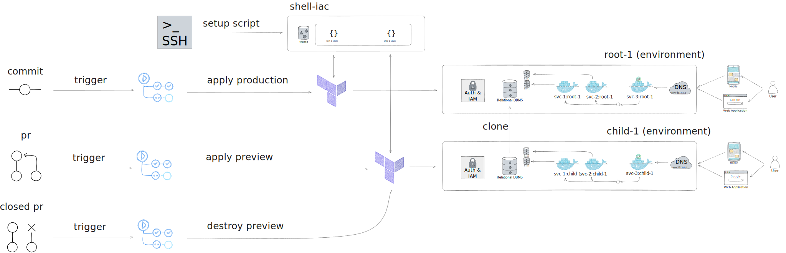

# Overview



# Setup a domain

- TODO

# Setup a Google Cloud Platform organization

## SignUp for Cloud Identity and verify domain

- (google) Access https://workspace.google.com/gcpidentity/signup;
- (google) Follow the sign up process using a domain you already own and an existing email account for that domain;
- (google) Follow the steps indicated in https://admin.google.com/ac/signup/setup/v2/gettingstarted to verify your domain;
- (google) Access your google identity account and verify your recovery e-mail, add 2-factor authentication and a recovery phone number;

## Create administrative groups

- (gcp) Navigate to GCP console and search for "Organization". Click in "set up your foundation";
- (gcp) Go to stp "Users & Groups" and click "create all groups". Follow default options;
  - (gcp) Check https://console.cloud.google.com/cloud-setup/users-groups to see suggested groups structure;
- (gcp) In "Administrative access" step, add "Project Deleter" role to the group of organization administrators;
  - (gcp) Check https://console.cloud.google.com/cloud-setup/administrator to see suggested roles for each group;

## Organization Setup

- (gcp) Follow foundation steps and download the configuration as a Terraform configuration.

# Setup Project

## Assumptions

- You are using a Linux operating system (Ubuntu 20.04);
- You already have gcloud cli pre-configured;
- You already have gh cli pre-configured (GitHub);

## Bootstrap GCP and GitHub

- (terminal) Login to Google Cloud Platform: `gcloud auth login`;
- (terminal) Login to GitHub: `gh auth login`;
- (terminal) Create GCP project, admin service account, resources and permissions, substituting the variables by actual values:

```bash
bash apps/kernel/shell-iac/project-setup.sh --gcp-project-id=$GCP_PROJECT_ID --gcp-billing-account-id=$GCP_BILLING_ACCOUNT_ID --domain=$DOMAIN --github-username=$GITHUB_USERNAME --github-repository=$GITHUB_REPOSITORY
```

- (terminal) Verify that the project was created: `gcloud projects list`;
- (terminal) Verify that the project is linked to the billing account:

```bash
gcloud beta billing projects list --billing-account=$GCP_BILLING_ACCOUNT_ID
```

- (terminal) Verify the roles associated with the created service account:

```bash
gcloud projects get-iam-policy $GCP_PROJECT_ID --flatten="bindings[].members" --format='table(bindings.role)' --filter="bindings.members:$GCP_SERVICE_ACCOUNT_EMAIL"
```

## Modify the name of the bucket

- (terraform) Verify that the name of the bucket in `apps/kernel/shell-iac/production/backend.tf`, includes the `gcp-project-id` you defined earlier in the placeholder `<your-project-name>`.

```hcl
terraform {
  backend "gcs" {
    bucket      = "<your-project-name>-tfstate"
    credentials = "credentials.json"               # The path to the JSON key file for the Service Account used to manage terraform
    prefix      = "production"                     # The path to the state file within the bucket
  }
}
```

- (note) It is not possible to populate that file using terraform variables, but you can change those values when calling `terraform init` if you pass `-backend-config` flag (e.g. `-backend-config='prefix=path/to/folder/within/bucket`);

## Manually add Project Creator and Billing Creator roles to service account

Adding roles in the organization level cannot yet be accomplished using the gcloud CLI and is necessary so that the service account can create projects or manage billing.

- (gcloud console) Access https://console.cloud.google.com/cloud-resource-manager;

  - Select your organization;
  - Go to permissions;
  - Add Project Creator role to service account;
  - Add Billing Account User role to service account;
  - Add Folder Admin role to service account;
  - Add Folder IAM Admin role to service account;

- References: https://cloud.google.com/resource-manager/docs/default-access-control

<!-- ## Step 04 - The following manual steps are optional depending on your need

3. Add Apigee Oganization Admin role to service account

- Necessary if you intend to create an apigee organization using terraform
- References: https://cloud.google.com/apigee/docs/hybrid/v1.10/precog-provision.html

6. Increase cloud build quota limits for europe-west3 (if using 2nd generation repositories and cloud build)

- Access https://console.cloud.google.com/apis/api/cloudbuild.googleapis.com/quotas?project=core-platform-shell-iac
- Select the europe-west3 region
- Click on "Edit Quotas"
- Define new quota limit (5)

7. Manually Connect GitHub repository with Google (if using 1st generation repositories and cloud build)

- Access https://console.cloud.google.com/cloud-build/triggers;region=global/connect?project=$GCP_PROJECT_ID
- Click on "Connect Repository" and follow instructions -->

<!-- ## Get Zitadel credentials

- (browser) Access your Zitadel instance and create a service user as documented in https://zitadel.com/docs/guides/integrate/private-key-jwt
- (browser) Create a personal access token to your service account as described in https://zitadel.com/docs/guides/integrate/pat
- (browser) Add service user as org owner and get json credentials as described in https://zitadel.com/docs/guides/integrate/access-zitadel-apis -->

## Setup GitHub Actions

- (github) Add the required GitHub Actions secrets to your repository in GitHub. The required variables are described in `apps/kernel/shell-iac/production/variables.tf` and mentioned in `.github/workflows/build-and-deploy.yml`. At the moment (2023-10-08) they are listed below. Not of them are in active use, but were left as reference before we compromise on any specific provider.

  - ATLASSIAN_CLOUD_ID
  - ATLASSIAN_DOMAIN
  - ATLASSIAN_USER_API_TOKEN
  - ATLASSIAN_USER_EMAIL
  - AUTH0_API_TOKEN
  - AUTH0_DEBUG
  - AUTH0_DOMAIN
  - CLOUDFLARE_ACCOUNT_ID
  - CLOUDFLARE_API_TOKEN
  - COMPASS_EXTERNAL_EVENT_SOURCE_ID
  - CORE_PLATFORM_SHELL_BROWSER_VITE_VERCEL_PROJECT_ID
  - CORE_ROOT_SHELL_GRAPH_VERCEL_PROJECT_ID
  - DX_DEV_DOCS_BROWSER_VERCEL_PROJECT_ID
  - GCP_BILLING_ACCOUNT_ID <!-- This value was populated from the setup script-->
  - GCP_DOCKER_ARTIFACT_REPOSITORY_NAME <!-- This value was populated from the setup script-->
  - GCP_GITHUB_INSTALLATION_ID
  - GCP_LOCATION <!-- This value was populated from the setup script-->
  - GCP_ORGANIZATION_ID
  - GCP_PROJECT_ID <!-- This value was populated from the setup script-->
  - GCP_TF_ADMIN_SERVICE_ACCOUNT_KEY <!-- This value was populated from the setup script-->
  - GH_ACTIONS_PERSONAL_ACCESS_TOKEN
  - MONGODB_ATLAS_ORG_ID
  - MONGODB_ATLAS_PRIVATE_KEY
  - MONGODB_ATLAS_PUBLIC_KEY
  - NEON_API_KEY
  - NEON_PROJECT_LOCATION
  - NX_ACCESS_TOKEN
  - OWNER_ACCOUNT_EMAIL
  - SUPPORT_ACCOUNT_EMAIL
  - VERCEL_API_TOKEN
  - ZITADEL_INSTANCE_DOMAIN
  - ZITADEL_TF_ADMIN_SERVICE_ACCOUNT_KEY

## Add the newly created service account email to search console

This step is required in order to manage DNS zones, domains and subdomains using terraform with a service account.

- (search console) Access https://search.google.com/search-console/users?resource_id=sc-domain%3Aamaralc.com
- (search console) Click "Add User" and add the terraform admin email account as owner;

## Push code to the "production" branch

- (git) Currently there is a github action setup to listen to "production" branch and apply terraform changes. Push code to "production" branch and wait for the action to run.
- (github actions) After the first successful run, re-run the action to use the enabled flag-management service (check kernel-flag-management module).

## Configure the correct name servers in your registrar

- (gcp) Navigate to the DNS page:
  - https://console.cloud.google.com/net-services/dns/zones/amaralc-com/details?project=<gcp-project-id>&supportedpurview=project,organizationId,folder
- (gcp) Click in "registrar setup" button in the right top;
- (gcp) Take note of the name servers;
- (registrar) Navigate to your registrar and make sure your domain is pointed to the same name servers listed before;

# Setup google oauth client through Firebase

8. Manually add Google Identity Aware Proxy (IAP) client after the first terraform run, from Firebase console.

- Access https://console.firebase.google.com/project/PROJECT_ID/authentication/providers and add a Google client manually
- Firebase will create its own iap client, with preconfigured callback urls.

## Enable apps that depend on Google OAuth Client

- (terraform) Enable any projects that depend on Google OAuth client. Since the first terraform run creates it and you enabled the OAuth client manually, now the following runs will be able to make use of that information;
