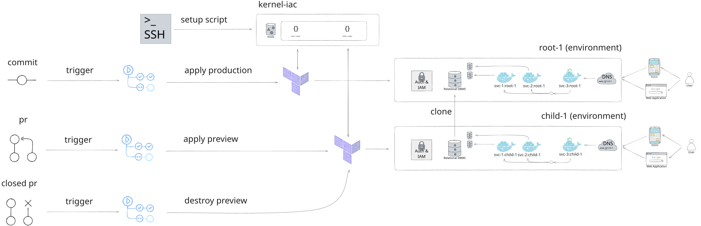

# Overview



# Setup a domain

- TODO

# Setup a Google Cloud Platform organization

## SignUp for Cloud Identity and verify domain

- (google) Access https://workspace.google.com/gcpidentity/signup;
- (google) Follow the sign up process using a domain you already own and an existing email account for that domain;
- (google) Follow the steps indicated in https://admin.google.com/ac/signup/setup/v2/gettingstarted to verify your domain;
- (google) Access your google identity account and verify your recovery e-mail, add 2-factor authentication and a recovery phone number;

## Create administrative groups

- (gcp) Navigate to GCP console and search for "Organization". Click in "set up your foundation";
- (gcp) Go to stp "Users & Groups" and click "create all groups". Follow default options;
  - (gcp) Check https://console.cloud.google.com/cloud-setup/users-groups to see suggested groups structure;
- (gcp) In "Administrative access" step, add "Project Deleter", "IAM Workload Identity Pool Admin (Beta)", "Tag Administrator" and "Tag User" roles to the group of organization administrators;
  - (gcp) Check https://console.cloud.google.com/cloud-setup/administrator to see suggested roles for each group;

## Setup Billing

- (gcp) Setup Payment method with CNPJ and Credit Card (or PIX);

## Organization Setup

- (gcp) Follow foundation steps and download the configuration as a Terraform configuration.

## Billing Account

- (gcp) Create a non-free billing account (free billing account will not be enough, failing with usage limits exceeded exception);

# Setup Project

## Assumptions

- You are using a Linux operating system (Ubuntu 20.04);
- You already have gcloud cli pre-configured;
- You already have gh cli pre-configured (GitHub);

## Bootstrap GCP and GitHub

- (terminal) Login to Google Cloud Platform: `gcloud auth login`;
- (terminal) Login to GitHub: `gh auth login`;
- (terminal) Create GCP project, admin service account, resources and permissions, substituting the variables by actual values:

```bash
sh {FOLDER_PATH}/project-setup.sh --owner-account-email=$OWNER_ACCOUNT_EMAIL --gcp-organization-id=$GCP_ORGANIZATION_ID --gcp-billing-account-id=$GCP_BILLING_ACCOUNT_ID --domain-name=$DOMAIN_NAME --github-username=$GITHUB_USERNAME --github-repository=$GITHUB_REPOSITORY --neon-api-key=$NEON_API_KEY --neon-project-location=$NEON_PROJECT_LOCATION --mongodb-atlas-org-id=$MONGODB_ATLAS_ORG_ID --mongodb-atlas-public-key=$MONGODB_ATLAS_PUBLIC_KEY --mongodb-atlas-private-key=$MONGODB_ATLAS_PRIVATE_KEY --nx-cloud-access-token-read-write=$NX_CLOUD_ACCESS_TOKEN_READ_WRITE --nx-cloud-access-token-read=$NX_CLOUD_ACCESS_TOKEN_READ
```

- (terminal) Verify that the project was created: `gcloud projects list`;
- (terminal) Verify that the project is linked to the billing account:

```bash
gcloud beta billing projects list --billing-account=$GCP_BILLING_ACCOUNT_ID
```

- (terminal) Verify the roles associated with the created service account:

```bash
gcloud projects get-iam-policy $GCP_PROJECT_ID --flatten="bindings[].members" --format='table(bindings.role)' --filter="bindings.members:$GCP_SERVICE_ACCOUNT_EMAIL"
```

## Modify the name of the bucket

- (terraform) Verify that the name of the bucket in `teams/kernel/iac/production/backend.tf`, includes the `gcp-project-id` defined earlier in the placeholder `<your-project-name>`.

```hcl
terraform {
  backend "gcs" {
    bucket = "<your-project-name>-tfstate"
    prefix = "production"
    # Authentication uses Application Default Credentials (ADC) from Workload Identity Federation
  }
}
```

- (note) It is not possible to populate that file using terraform variables, but you can change those values when calling `terraform init` if you pass `-backend-config` flag (e.g. `-backend-config='prefix=path/to/folder/within/bucket`);
- (note) Authentication uses Workload Identity Federation (WIF) via Application Default Credentials. No `credentials.json` file is needed. The `project-setup.sh` script creates a WIF pool and OIDC provider that allows GitHub Actions to impersonate the Terraform admin service account;

## Organization-Level IAM Roles

The `project-setup.sh` script automatically grants all required organization-level IAM roles to the service account:

- `roles/resourcemanager.organizationViewer` — View organization resources
- `roles/resourcemanager.folderAdmin` — Create and manage folders
- `roles/resourcemanager.projectCreator` — Create new GCP projects
- `roles/resourcemanager.folderIamAdmin` — Manage IAM policies on folders
- `roles/billing.user` — Link and manage billing accounts

These roles are granted automatically during bootstrap and are necessary for the service account to provision infrastructure, create projects, and manage billing in CI/CD workflows.

- References: https://cloud.google.com/resource-manager/docs/default-access-control

## Add the newly created service account email to search console

This step is required in order to manage DNS zones, domains and subdomains using terraform with a service account.

- (search console) Access https://search.google.com/search-console/users?resource_id=sc-domain%3Aamaralc.com
- (search console) Click "Add User" and add the terraform admin email account as owner;

## Push code to the "production" branch

- (git) Currently there is a github action setup to listen to "production" branch and apply terraform changes. Push code to "production" branch and wait for the action to run.
- (github actions) After the first successful run, re-run the action to use the enabled flag-management service (check kernel-flag-management module).

## Configure the correct name servers in your registrar

- (gcp) Navigate to the DNS page:
  - https://console.cloud.google.com/net-services/dns/zones/amaralc-com/details?project=<gcp-project-id>&supportedpurview=project,organizationId,folder
- (gcp) Click in "registrar setup" button in the right top;
- (gcp) Take note of the name servers;
- (registrar) Navigate to your registrar and make sure your domain is pointed to the same name servers listed before;

# Setup google oauth client through Firebase

8. Manually add Google Identity Aware Proxy (IAP) client after the first terraform run, from Firebase console.

- Access https://console.firebase.google.com/project/PROJECT_ID/authentication/providers and add a Google client manually
- Firebase will create its own iap client, with preconfigured callback urls.

## Enable apps that depend on Google OAuth Client

- (terraform) Enable any projects that depend on Google OAuth client. Since the first terraform run creates it and you enabled the OAuth client manually, now the following runs will be able to make use of that information;
